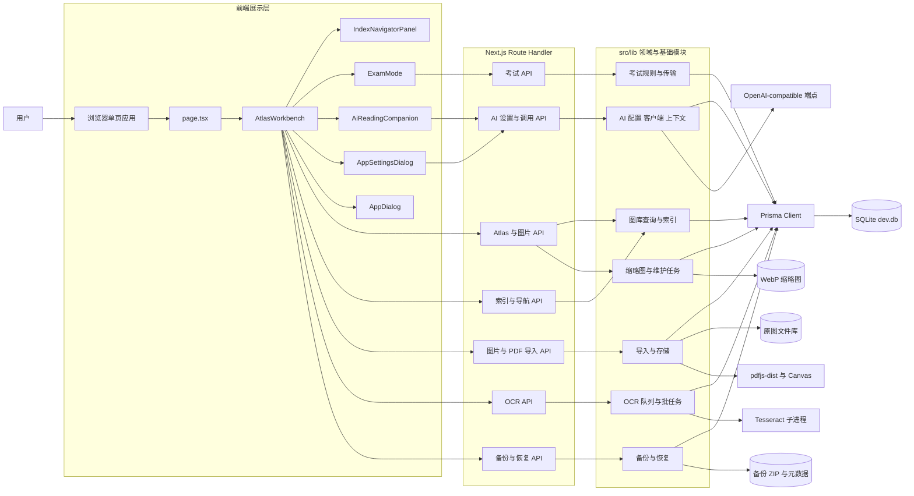
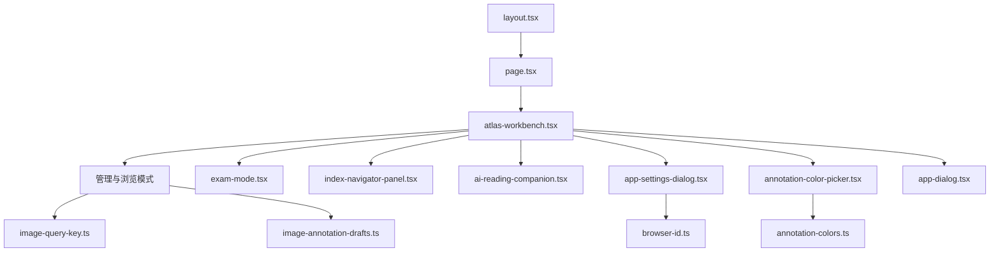
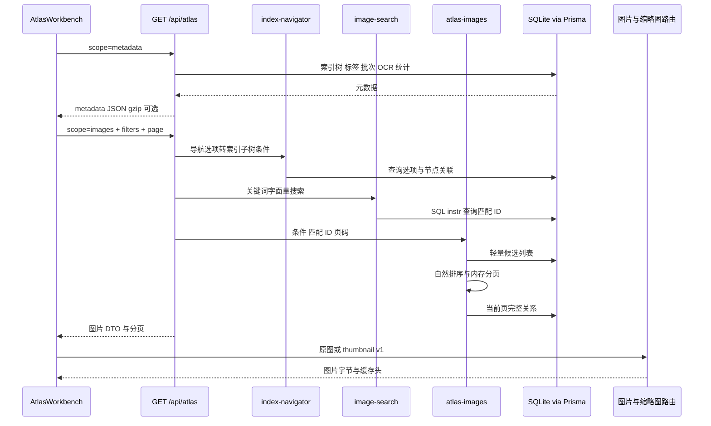
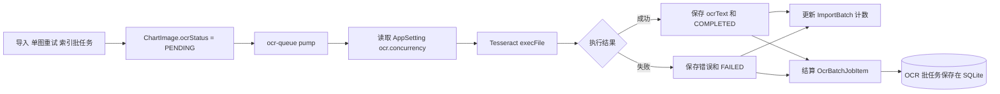
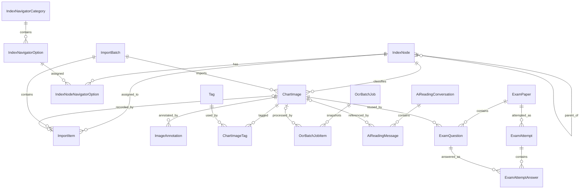
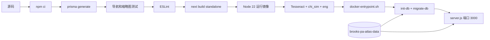

# Brooks PA Atlas 项目架构地图

> 本文档描述当前代码，而不是目标架构。分析基于 `main` 分支提交 `f8ef229`，日期为 2026-09-30。除 `src/generated/prisma`、`.next`、`node_modules`、本地数据和日志外，仓库现有 97 个生产 TypeScript/TSX 文件、约 23,646 行生产代码、54 个 Route Handler 文件和 80 个 HTTP 方法。

## 1. 架构总览

Brooks PA Atlas 是一个单页、本地优先的 Next.js App Router 应用。浏览器端只有一个页面入口，所有管理、浏览、考试、OCR、备份和 AI 交互都挂在同一个工作台中。服务端使用 Next.js Route Handler 暴露 API，业务逻辑主要位于 `src/lib`，持久化由 Prisma 7 + `better-sqlite3` 驱动 SQLite，同时把原图、缩略图、备份和部分任务状态写入本地文件系统。

当前架构可以概括为：

- 展示层：React 客户端组件，核心状态集中在 `AtlasWorkbench`。
- 接口层：`src/app/api/**/route.ts`，负责 HTTP 解析、校验、状态码和响应流。
- 领域/应用层：`src/lib/*.ts`，包含导入、索引、OCR、备份、考试、AI、缩略图等逻辑。
- 数据访问层：`src/lib/db.ts` 提供 Prisma 单例；查询并未统一封装成 repository，Route Handler 和领域模块都可直接使用 Prisma。
- 持久化层：SQLite 保存业务元数据，本地目录保存图片和派生文件。
- 外部能力：Tesseract 子进程、本地 PDF 渲染栈、OpenAI-compatible HTTP 端点。



## 2. 主要目录及职责

| 路径 | 职责 | 是否运行时关键 |
| --- | --- | --- |
| `src/app/` | App Router 页面、根布局、全局样式和客户端 UI 组件 | 是 |
| `src/app/api/` | 全部服务端 HTTP 入口；54 个 `route.ts` | 是 |
| `src/lib/` | 领域规则、业务编排、数据查询、文件存储、后台任务和外部服务客户端 | 是 |
| `src/generated/prisma/` | `prisma generate` 生成的 Prisma Client | 是，但禁止手改 |
| `src/types/` | 第三方库缺失的类型声明，目前为 `yazl` | 构建期 |
| `prisma/schema.prisma` | 数据模型、关系、唯一约束和索引 | 是 |
| `prisma/migrations/` | 初始 schema 与 10 个增量 migration | 部署/升级 |
| `scripts/` | SQLite 初始化和顺序执行 migration | 启动/部署 |
| `docs/` | 产品规格、部署陷阱与本文档 | 维护 |
| `public/` | create-next-app 默认静态资源，目前非核心业务资源 | 否 |
| `Dockerfile` | standalone 多阶段构建；运行镜像安装 Tesseract 中英文语言包 | 部署 |
| `compose.yaml` | 端口、环境变量、健康检查、持久卷 | 部署 |
| `docker-entrypoint.sh` | 先初始化/迁移 SQLite，再启动 standalone `server.js` | 部署 |
| `next.config.ts` | standalone 输出、PDF worker tracing、原生包外置、开发来源配置 | 构建/运行 |
| `package.json` | 依赖、构建、lint、分组测试、数据库脚本 | 构建/维护 |
| `AGENTS.md` | 项目维护规则、行为约束和安全要求 | 维护 |

### 2.1 运行时生成目录

这些目录或文件不是业务源码：

| 路径 | 内容 | 持久性 |
| --- | --- | --- |
| `.next/` | Next.js 构建与开发产物 | 可重建 |
| `dev.db` | 默认本地 SQLite 数据库 | 业务数据 |
| `data/library/images/` | 原始图库，数据库只保存相对路径 | 业务数据 |
| `data/library/thumbnails/` | 版本化 WebP 缩略图缓存 | 可重建 |
| `data/library/thumbnail-jobs/` | 缩略图维护任务 JSON 快照 | 任务状态 |
| `data/library/backups/` | 持久备份 ZIP 及同名 JSON 元数据 | 业务备份 |
| 系统临时目录下的 `brooks-pa-atlas-restore/` | 恢复上传的临时 ZIP | 临时 |
| `src/generated/prisma/` | Prisma 生成代码 | 可重建 |
| `*.log`、`*.tsbuildinfo` | 日志与编译缓存 | 可重建 |

Docker Compose 将命名卷 `brooks-pa-atlas-data` 挂载到 `/app/data`。容器内 SQLite 为 `/app/data/dev.db`，图库为 `/app/data/library/images`。

## 3. 前端入口与组件边界

### 3.1 启动链

1. `src/app/layout.tsx` 创建根 HTML 布局，加载 Geist 字体和 `globals.css`。
2. `src/app/page.tsx` 是唯一页面入口，只渲染 `AtlasWorkbench`。
3. `src/app/atlas-workbench.tsx` 声明为客户端组件，是管理模式和浏览模式的状态中心，也负责切换考试模式。
4. 工作台按需渲染考试、导航、设置、AI 伴读、颜色选择器和统一弹窗。



### 3.2 前端模块职责

| 文件 | 规模 | 当前职责 |
| --- | ---: | --- |
| `src/app/atlas-workbench.tsx` | 7,253 行 | 工作台总状态、管理/浏览 UI、图片查询、导入、索引操作、标签、详情、标注、OCR、备份、快捷键、分页和本地偏好 |
| `src/app/exam-mode.tsx` | 2,926 行 | 试卷列表、出题、遮罩编辑、发布、考试、评分结果和历史复盘 |
| `src/app/index-navigator-panel.tsx` | 1,265 行 | 导航筛选、本地匹配计数、分类/选项管理、节点批量关联 |
| `src/app/ai-reading-companion.tsx` | 939 行 | 多会话、分页历史、NDJSON 流式回复、可见思考过程、拖拽缩放和 UI 偏好 |
| `src/app/app-settings-dialog.tsx` | 850 行 | AI 端点与技能配置、模型发现、连接测试、密钥清除/保留语义 |
| `src/app/app-dialog.tsx` | 270 行 | 应用内 alert/confirm/prompt、焦点恢复、键盘和危险色调 |
| `src/app/annotation-color-picker.tsx` | 177 行 | 标注颜色菜单和系统自定义颜色入口 |

### 3.3 前端状态来源

- 服务端业务状态：通过 `fetch` 调用 `/api/**`，没有 Redux、React Query 或统一 API client。
- 页面会话状态：保存在各客户端组件的 `useState`、`useRef` 和 memo 中。
- 用户偏好：挂载后读取 `localStorage`，避免 hydration mismatch。
- 图片原文件：浏览器通过 `/api/images/[id]/file` 读取。
- 网格缩略图：浏览器通过 `/api/images/[id]/thumbnail?v=1` 读取。
- AI 回复：`AiReadingCompanion` 读取 NDJSON `ReadableStream`，不是 WebSocket 或 SSE 浏览器对象。

### 3.4 前端热点

- `AtlasWorkbench` 同时承担页面编排、数据请求、领域交互和大量渲染，已经形成明显的前端单体。
- API DTO 多数直接在组件内重复声明，没有共享的 API contract 包。
- `fetch` 分散在五个大型组件内；错误处理、取消、轮询和解析方式不完全统一。
- 导航匹配计算已正确下沉到纯函数 `index-navigator-client.ts`，这是现有代码中较清晰的可测试边界。

## 4. 后端入口

后端没有独立 Express/Nest 进程。所有 HTTP 入口都由 Next.js App Router 的 `src/app/api/**/route.ts` 提供，默认与页面运行在同一个 Node.js 进程中。涉及文件系统、PDF、OCR 和流的路由要求 Node.js runtime。

### 4.1 接口层职责

Route Handler 当前承担以下工作：

- 解析 query、JSON、`multipart/form-data` 或原始请求流。
- 使用 Zod 或手工条件做输入校验。
- 调用 `src/lib` 领域函数，或直接调用 Prisma。
- 组织事务、状态码、缓存头、Range、gzip 和 NDJSON 流。
- 将领域异常映射为客户端可见错误。

### 4.2 后端模块入口

| API 族 | Route Handler | 主要服务模块 | 主要存储/外部依赖 |
| --- | --- | --- | --- |
| 工作台聚合 | `/api/atlas` | `atlas-images`, `image-search`, `index-tree`, `index-navigator`, `image-annotations` | Prisma/SQLite |
| 图片 | `/api/images/**` | `storage`, `thumbnails`, `tags`, `image-annotations`, `ocr-queue` | SQLite + 原图/缩略图 |
| 索引树 | `/api/index-nodes/**` | `index-tree`, `storage`, `thumbnails`, `tags` | SQLite + 文件删除 |
| 导航属性 | `/api/index-navigator/**` | `index-navigator` | SQLite |
| 图片导入 | `/api/import` | `import-images`, `storage`, `ocr-queue` | SQLite + 原图/缩略图 |
| PDF 导入 | `/api/import/documents/**` | `pdf-importer`, `document-import-jobs` | PDF runtime + SQLite + 文件系统 |
| OCR | `/api/ocr/**` | `ocr-queue`, `ocr-batch-jobs` | SQLite + Tesseract |
| 缩略图维护 | `/api/maintenance/thumbnails/jobs/**` | `thumbnail-jobs`, `thumbnails` | SQLite + 原图 + JSON 任务文件 |
| 备份/恢复 | `/api/backups/**` | `backup`, `backup-jobs`, `download-response` | SQLite + 原图 + ZIP + 临时文件 |
| 考试 | `/api/exam/**` | `exam`, `exam-paper-transfer` | SQLite |
| AI 设置 | `/api/settings/ai/**` | `ai-config`, `ai-settings`, `ai-client` | SQLite + 上游 HTTP |
| AI OCR 精校 | `/api/ai/ocr-refine` | `ai-ocr-refinement`, `ai-client`, `ai-settings`, `storage` | SQLite + 原图 + 上游 HTTP |
| AI 阅读伴侣 | `/api/ai/reading-companion/**` | `ai-reading-companion`, `ai-reading-context`, `ai-client`, `ai-settings` | SQLite + 原图 + 上游流式 HTTP |

## 5. API 调用关系

### 5.1 前端调用矩阵

| 前端调用方 | API | 方法 | 用途 |
| --- | --- | --- | --- |
| `AtlasWorkbench` | `/api/atlas?scope=metadata` | GET | 索引树、标签、导入批次和统计 |
| `AtlasWorkbench` | `/api/atlas?scope=images...` | GET | 搜索、索引、标签、导航条件和分页后的图片 |
| `AtlasWorkbench` | `/api/images/[id]` | GET/PATCH/DELETE | 完整详情、更新详情、删除单图 |
| `AtlasWorkbench` | `/api/images/[id]/annotations` | PUT | 替换单图标注 |
| `AtlasWorkbench` | `/api/images/selection-summary` | POST | 跨页选中图片的标签摘要 |
| `AtlasWorkbench` | `/api/images/tags` | PATCH | 批量增删标签 |
| `AtlasWorkbench` | `/api/import` | POST | 80 张一批的图片上传 |
| `AtlasWorkbench` | `/api/import/[id]/undo` | POST | 撤销导入批次 |
| `AtlasWorkbench` | `/api/import/documents/jobs` | POST | 启动 PDF 后台导入 |
| `AtlasWorkbench` | `/api/import/documents/jobs/[id]` | GET 轮询 | PDF 导入进度 |
| `AtlasWorkbench` | `/api/index-nodes` | POST/PATCH/DELETE | 新建、排序、重命名、删除索引 |
| `AtlasWorkbench` | `/api/index-nodes/[id]/clear-images` | POST | 清空索引子树图片 |
| `AtlasWorkbench` | `/api/ocr/images/[id]` | POST | 单图 OCR |
| `AtlasWorkbench` | `/api/ocr/index-nodes/[id]/batch` | GET/POST | 读取批任务摘要、启动批量 OCR |
| `AtlasWorkbench` | `/api/ocr/jobs/active`、`/api/ocr/jobs/[id]` | GET 轮询 | 恢复/查询 OCR 批任务 |
| `AtlasWorkbench` | `/api/backups/export/jobs` | POST | 启动备份 |
| `AtlasWorkbench` | `/api/backups/restore/jobs` | POST | 以原始 ZIP body 启动恢复 |
| `AtlasWorkbench` | `/api/backups/{export或restore}/jobs/[id]` | GET 轮询 | 备份/恢复进度 |
| `AtlasWorkbench` | `/api/backups/records`、`/[id]` | GET/DELETE | 列出、下载入口、删除持久备份 |
| `AtlasWorkbench` | `/api/settings/ai` | GET | 判断 AI 技能是否就绪 |
| `AtlasWorkbench` | `/api/ai/ocr-refine` | POST | AI 精校 OCR 草稿 |
| `IndexNavigatorPanel` | `/api/index-navigator` | GET | 一次性读取分类、选项和全部节点关联 |
| `IndexNavigatorPanel` | `/api/index-navigator/categories` | POST/PATCH/DELETE | 分类增改删和排序 |
| `IndexNavigatorPanel` | `/api/index-navigator/options` | POST/PATCH/DELETE | 选项增改删和排序 |
| `IndexNavigatorPanel` | `/api/index-navigator/assignments` | POST/PATCH | 分块读取和修改节点关联 |
| `ExamMode` | `/api/exam/papers/**` | GET/POST/PATCH/DELETE | 试卷、题目、拷贝、导入导出、发布和历史 |
| `ExamMode` | `/api/exam/questions/[id]` | PATCH/DELETE | 保存或移除题目 |
| `ExamMode` | `/api/exam/attempts/**` | GET/POST | 开始考试、读取考试、提交评分 |
| `ExamMode` | `/api/images` | GET | 从图库分页选题 |
| `AppSettingsDialog` | `/api/settings/ai` | GET/PUT | 读取脱敏设置、整体保存设置 |
| `AppSettingsDialog` | `/api/settings/ai/models` | POST | 拉取模型列表 |
| `AppSettingsDialog` | `/api/settings/ai/test` | POST | 测试 Chat Completions 连接 |
| `AiReadingCompanion` | `/api/ai/reading-companion/conversations` | GET/POST | 列出/创建会话 |
| `AiReadingCompanion` | `/api/ai/reading-companion/conversations/[id]` | GET/PATCH/DELETE | 分页历史、重命名、删除会话 |
| `AiReadingCompanion` | `/api/ai/reading-companion/conversations/[id]/messages` | POST/DELETE | 流式对话、清空消息 |

### 5.2 完整后端路由清单

以下路由也包含兼容或运维入口，即使当前主 UI 不直接调用。

| 路由 | 方法 | 核心调用 |
| --- | --- | --- |
| `/api/atlas` | GET | `findAtlasImagePage`, `findLiteralSearchImageIds`, `navigatorImageWhere`, `getIndexTree` |
| `/api/images` | GET | Prisma 图库查询，供考试选图 |
| `/api/images/[id]` | GET/PATCH/DELETE | Prisma 事务、标签、OCR、原图和缩略图清理 |
| `/api/images/[id]/annotations` | PUT | 标注 schema + Prisma 替换事务 |
| `/api/images/[id]/file` | GET | `readStoredImage` |
| `/api/images/[id]/thumbnail` | GET | `readThumbnail` / `ensureStoredImageThumbnail` |
| `/api/images/selection-summary` | POST | Prisma count/groupBy |
| `/api/images/tags` | PATCH | `ensureTags`, `connectImageTags`, `cleanupUnusedTags` |
| `/api/index-nodes` | GET/POST/PATCH/DELETE | `index-tree` + 直接 Prisma |
| `/api/index-nodes/[id]/clear-images` | POST | Prisma 校验 + 逐文件删除 + 缩略图清理 |
| `/api/index-navigator` | GET | `getNavigatorBootstrap` |
| `/api/index-navigator/categories` | POST/PATCH/DELETE | Prisma + 名称规范化 |
| `/api/index-navigator/options` | POST/PATCH/DELETE | Prisma + 名称规范化 |
| `/api/index-navigator/assignments` | GET/POST/PATCH | Prisma 节点选项关联 |
| `/api/import` | POST | `importImageBuffer`, `updateBatchCounters`, `scheduleOcrPump` |
| `/api/import/[id]/undo` | POST | Prisma 引用校验 + 逐文件删除 |
| `/api/import/documents` | POST | 同步 `pdfImporter.importDocument`，兼容入口 |
| `/api/import/documents/jobs` | POST | `startDocumentImportJob` |
| `/api/import/documents/jobs/[id]` | GET | `getDocumentImportJob` |
| `/api/ocr/images/[id]` | POST | `queueImageOcr` |
| `/api/ocr/retry` | POST | `retryFailedOcr` |
| `/api/ocr/index-nodes/[id]/batch` | GET/POST | `getIndexOcrBatchSummary`, `startIndexOcrBatchJob` |
| `/api/ocr/jobs/active` | GET | `getActiveOcrBatchJob`, `resumeActiveOcrBatchJob` |
| `/api/ocr/jobs/[id]` | GET | `getOcrBatchJob`, `resumeActiveOcrBatchJob` |
| `/api/maintenance/thumbnails/jobs` | GET/POST | `getLatestThumbnailJob`, `startThumbnailJob` |
| `/api/maintenance/thumbnails/jobs/[id]` | GET | `getThumbnailJob` |
| `/api/backups/export` | GET | 同步 `createBackupZip` 流式下载，兼容入口 |
| `/api/backups/export/jobs` | POST | `startBackupJob` |
| `/api/backups/export/jobs/[id]` | GET/HEAD | 任务状态 |
| `/api/backups/export/jobs/[id]/file` | GET/HEAD | ZIP Range 下载 |
| `/api/backups/records` | GET | `listBackupRecords` |
| `/api/backups/records/[id]` | GET/HEAD/DELETE | 下载或逐文件删除备份记录 |
| `/api/backups/restore` | POST | 同步流式上传 + `restoreBackupZipFromFile`，兼容入口 |
| `/api/backups/restore/jobs` | POST | 临时文件 + `startRestoreJobFromFile` |
| `/api/backups/restore/jobs/[id]` | GET | 恢复任务状态 |
| `/api/exam/papers` | GET/POST | 试卷列表/新建草稿 |
| `/api/exam/papers/import` | POST | 轻量 JSON 校验 + hash 映射 + Prisma 事务 |
| `/api/exam/papers/[id]` | GET/PATCH/DELETE | 试卷详情、草稿修改、删除 |
| `/api/exam/papers/[id]/copy` | POST | Prisma 拷贝事务 |
| `/api/exam/papers/[id]/export` | GET | `buildExamPaperTransfer` |
| `/api/exam/papers/[id]/questions` | POST | 添加图库图片为题目 |
| `/api/exam/papers/[id]/publish` | POST | 完整性校验和发布 |
| `/api/exam/papers/[id]/attempts` | GET | 最近考试记录 |
| `/api/exam/questions/[id]` | PATCH/DELETE | 题目规则校验和修改 |
| `/api/exam/attempts` | POST | 随机题序并创建考试 |
| `/api/exam/attempts/[id]` | GET | 考试/结果序列化 |
| `/api/exam/attempts/[id]/submit` | POST | 答案规范化、评分和事务保存 |
| `/api/settings/ai` | GET/PUT | `readAiConfigDto`, `saveAiConfig` |
| `/api/settings/ai/models` | POST | `fetchAiModels` |
| `/api/settings/ai/test` | POST | `testAiConnection` |
| `/api/ai/ocr-refine` | POST | 原图压缩 + 非流式多模态调用 |
| `/api/ai/reading-companion/conversations` | GET/POST | 会话列表/创建 |
| `/api/ai/reading-companion/conversations/[id]` | GET/PATCH/DELETE | 历史分页/会话修改 |
| `/api/ai/reading-companion/conversations/[id]/messages` | POST/DELETE | NDJSON 流式调用/清空消息 |

## 6. 关键数据流

### 6.1 图库读取、筛选与浏览

`AtlasWorkbench` 把元数据和图片热路径拆成两个请求：

1. `scope=metadata` 读取索引树、标签、导入批次和 OCR 统计。
2. `scope=images` 携带关键词、索引、精确标签、导航选项和页码。
3. `/api/atlas` 先把导航选项解析为匹配索引子树；关键词用 SQLite `instr(lower(...))` 做字面量匹配。
4. `findAtlasImagePage` 读取所有候选图片的轻量字段，在 Node.js 中按文件名自然排序，再取当前页 ID。
5. 第二次 Prisma 查询补齐当前页的索引、标签和标注。
6. 浏览器用原图接口显示查看器，用缩略图接口显示网格。



### 6.2 普通图片导入

1. 浏览器把文件按 80 张分块，提交 `multipart/form-data`。
2. Route Handler 创建或复用 `ImportBatch`。
3. `importImageBuffer` 计算 SHA-256；重复 hash 只记 `DUPLICATE`。
4. 新图片先保存原图，读取尺寸并生成缩略图，然后写入 `ChartImage` 和 `ImportItem`。
5. 未启用 OCR 时状态为 `SKIPPED`；启用时为 `PENDING` 并调度 OCR pump。
6. 批次计数由数据库现状重新统计，而不是仅依赖内存累加。

### 6.3 PDF 资料导入

1. UI 将 PDF 上传到 `/api/import/documents/jobs`；文件在请求阶段被读入 Buffer。
2. `document-import-jobs.ts` 在当前 Node.js 进程内创建任务并异步调用 `pdfImporter`。
3. `pdfjs-dist` 读取页数和 outline，`@napi-rs/canvas` 渲染页面，`sharp` 压缩为 JPEG。
4. PDF 文件名成为容器索引，书签路径通过 `ensureIndexPath` 转成层级索引。
5. 每页复用 `importImageBuffer`，因此与普通图片共享 hash 去重、图库和数据库规则。
6. UI 每 600ms 轮询进程内任务；进程重启会丢失未完成的任务视图，但已写入的数据库和图片不会回滚。

### 6.4 OCR 数据流



OCR 队列本身用进程内 `Set` 和 worker 计数防止当前进程重复执行，但待处理图片和批任务都在 SQLite，可通过 `/api/ocr/jobs/active` 恢复。Tesseract 默认语言是 `chi_sim+eng`，单次执行超时 120 秒。

### 6.5 备份与恢复

- 备份：分页读取 SQLite 元数据和图片路径，校验每个原图，流式生成 ZIP，写入 `data/library/backups/`，再写独立 JSON 元数据。
- 下载：支持 HEAD 和 HTTP Range，不将完整 ZIP 读入 Node.js 内存。
- 恢复：原始 ZIP request body 流式写入一个临时文件；验证 manifest 和 zip entry 后逐条解压。
- 合并语义：索引按路径复用/创建，图片按 SHA-256 更新/创建，不删除备份外数据。
- 一致性：数据库事务可以保护一组元数据修改，但数据库和文件系统之间没有跨资源事务，代码依靠临时文件、明确路径、顺序操作和错误处理降低风险。

### 6.6 AI OCR 精校与阅读伴侣

- AI 设置以 `ai.config.v1` JSON 存在 `AppSetting`；服务端保存完整 API key，对客户端只返回 `hasApiKey` 等脱敏 DTO。
- OCR 精校读取原图、压缩为 JPEG、多模态调用上游，只返回草稿，不直接写 `ocrText`。
- 阅读伴侣在发送用户消息时固化图片元数据快照，把近期消息和有限张参考图组装为 Chat Completions 消息。
- 上游流经服务端转换为逐行 JSON：`start`、`thinking_start`、`reasoning_delta`、`thinking_done`、`delta`、`done` 或 `error`。
- 用户消息、助手正文、可见思考内容和耗时最终写入 SQLite。

### 6.7 考试流

图库图片通过 `ChartImage` 被题目引用，不复制文件。试卷从草稿到发布后锁定；开始考试时服务端随机题序并预建答案记录；提交时按题型规范化答案，在事务内写答案、正确数、耗时和正确率。`ExamQuestion -> ChartImage` 使用 Restrict，因此被试题引用的图片不能删除。

## 7. 数据库访问层

### 7.1 连接与初始化

- `src/lib/db.ts` 是唯一 Prisma Client 创建点。
- Prisma 7 使用 `PrismaBetterSqlite3` adapter。
- 数据库 URL 来自 `DATABASE_URL`，默认 `file:./dev.db`。
- 开发环境把 client 缓存在 `globalThis`，避免热更新重复创建连接。
- `scripts/init-db.mjs` 在空库上执行初始 migration，再加载 `migrate-db.mjs`。
- `scripts/migrate-db.mjs` 用 `_brooks_migrations` 表记录项目内 SQL migration；不依赖运行时 `prisma migrate deploy`。

### 7.2 当前数据访问分层

当前没有正式 repository 层，存在三种访问方式：

1. Route Handler 直接 Prisma：图片详情、索引 CRUD、导航 CRUD、考试 CRUD、AI 会话等。
2. 查询/领域模块封装 Prisma：`atlas-images`、`image-search`、`index-tree`、`index-navigator`、`ocr-batch-jobs`、`ai-settings` 等。
3. 大型应用服务同时访问 Prisma 和文件系统：`backup`、`pdf-importer`、`import-images`、`ocr-queue`、`thumbnail-jobs`。

这意味着 `db.ts` 是连接层，不是完整的数据访问层。重构时不能假设所有数据访问都已从接口层隔离。

### 7.3 数据模型分组

| 领域 | 模型 | 关键关系/约束 |
| --- | --- | --- |
| 索引与导航 | `IndexNode`, `IndexNavigatorCategory`, `IndexNavigatorOption`, `IndexNodeNavigatorOption` | 无限树；同父同名唯一；节点与选项多对多 |
| 图库 | `ChartImage`, `Tag`, `ChartImageTag`, `ImageAnnotation` | hash 和 libraryPath 唯一；标签多对多；标注级联删除 |
| 导入 | `ImportBatch`, `ImportItem` | 图片批次统计；`ImportItem.chartImageId` 唯一 |
| OCR | `OcrBatchJob`, `OcrBatchJobItem` | `activeKey` 保证全局单个活动批任务；任务快照持久化 |
| AI | `AppSetting`, `AiReadingConversation`, `AiReadingMessage` | 配置 JSON；消息按会话 sequence 唯一；图片删除后引用置空 |
| 考试 | `ExamPaper`, `ExamQuestion`, `ExamAttempt`, `ExamAttemptAnswer` | 题目限制删除图片；答案引用题目；题序在 attempt 内唯一 |



### 7.4 文件与数据库的边界

- SQLite 只保存图片相对路径和元数据，不保存图片 blob。
- `storage.absoluteImagePath()` 验证解析后的路径仍位于图库根目录内。
- 缩略图由图片 hash 定位，属于可重建派生数据。
- 删除单图、撤销导入、清空索引和删除备份时，代码必须逐个明确路径删除；不得改为通配符、目录或递归删除。
- 图片文件删除前必须检查考试题引用；数据库关系也用 Restrict 提供第二道保护。

## 8. 核心模块依赖关系

### 8.1 `src/lib` 依赖图

箭头表示“调用/依赖”。纯函数模块位于图的上方或边缘，I/O 模块最终汇聚到 Prisma、文件系统或外部服务。

```mermaid
flowchart TD
  subgraph Pure[纯规则与契约]
    AiConfig[ai-config]
    Exam[exam]
    ExamTransfer[exam-paper-transfer]
    Annotation[image-annotations]
    AnnotationDraft[image-annotation-drafts]
    AnnotationColors[annotation-colors]
    QueryKey[image-query-key]
    NavClient[index-navigator-client]
    OcrState[ocr-batch-job-state]
    DocContract[document-importers]
    Download[download-response]
  end

  subgraph Data[数据查询与关系]
    DB[db]
    AtlasImages[atlas-images]
    Search[image-search]
    IndexTree[index-tree]
    Navigator[index-navigator]
    Tags[tags]
    AiSettings[ai-settings]
  end

  subgraph Files[文件与派生资源]
    Storage[storage]
    Thumbnails[thumbnails]
    ThumbnailJobs[thumbnail-jobs]
  end

  subgraph Workflows[应用工作流]
    ImportImages[import-images]
    PdfImporter[pdf-importer]
    DocJobs[document-import-jobs]
    OcrJobs[ocr-batch-jobs]
    OcrQueue[ocr-queue]
    Backup[backup]
    BackupJobs[backup-jobs]
  end

  subgraph AI[AI]
    AiClient[ai-client]
    AiOcr[ai-ocr-refinement]
    ReadingRules[ai-reading-companion]
    ReadingContext[ai-reading-context]
  end

  ExamTransfer --> Exam
  AtlasImages --> DB
  Search --> DB
  IndexTree --> DB
  Navigator --> DB
  AiSettings --> AiConfig
  AiSettings --> DB

  Thumbnails --> Storage
  ThumbnailJobs --> Thumbnails
  ThumbnailJobs --> DB

  ImportImages --> IndexTree
  ImportImages --> Storage
  ImportImages --> Thumbnails
  ImportImages --> DB
  PdfImporter --> DocContract
  PdfImporter --> ImportImages
  PdfImporter --> IndexTree
  PdfImporter --> OcrQueue
  PdfImporter --> DB
  DocJobs --> DocContract

  OcrJobs --> OcrState
  OcrJobs --> DB
  OcrQueue --> OcrJobs
  OcrQueue --> Storage
  OcrQueue --> DB

  Backup --> Exam
  Backup --> Annotation
  Backup --> Navigator
  Backup --> Storage
  Backup --> Tags
  Backup --> DB
  BackupJobs --> Backup
  BackupJobs --> Download

  AiClient --> AiConfig
  AiOcr --> AiClient
  AiOcr --> AiConfig
  ReadingRules --> AiClient
  ReadingContext --> ReadingRules
  ReadingContext --> AiOcr
  ReadingContext --> Storage
  ReadingContext --> DB
```



### 8.2 模块清单

#### 图库、索引和标签

| 模块 | 职责 |
| --- | --- |
| `atlas-images.ts` | 全库候选轻量查询、自然排序、服务端分页、当前页关系补齐 |
| `image-search.ts` | 使用参数化 raw SQL 做 `%`、`_`、反斜杠安全的字面量搜索 |
| `index-tree.ts` | 创建节点、按路径补全节点、构建含子树图片计数的树 |
| `index-navigator.ts` | 导航 bootstrap、跨分类 AND 匹配、图片子树 where 条件 |
| `index-navigator-client.ts` | 浏览器端关联索引、匹配计数、置灰、目录搜索和分页 |
| `tags.ts` | 标签规范化、创建、连接、替换和清理孤儿标签 |
| `image-annotations.ts` | 标注 Zod schema、数量/坐标/颜色限制和序列化 |

#### 导入、文件与缩略图

| 模块 | 职责 |
| --- | --- |
| `storage.ts` | 图库根、类型检查、Buffer、SHA-256、文件名、保存/读取、安全路径、尺寸 |
| `import-images.ts` | 单张 Buffer 的统一入库、hash 去重、ImportItem、缩略图 |
| `document-importers.ts` | 文档 importer 接口和进度契约 |
| `document-import-jobs.ts` | 进程内 PDF 导入任务注册表，TTL 30 分钟 |
| `pdf-importer.ts` | PDF worker、书签解析、页面渲染压缩、索引映射和并发导入 |
| `thumbnails.ts` | 版本化路径、WebP 生成、并发合并、缓存读取和单文件删除 |
| `thumbnail-jobs.ts` | 缺失缩略图扫描、有限并发、JSON 原子持久化和重启中断识别 |

#### OCR

| 模块 | 职责 |
| --- | --- |
| `ocr-queue.ts` | 调度 pump、并发 worker、Tesseract 子进程、图片/批次状态更新 |
| `ocr-batch-jobs.ts` | 子树快照、确认规则、全局活动任务约束、item 结算和恢复 |
| `ocr-batch-job-state.ts` | 文本判断、终态和进度的纯函数 |

#### 备份与恢复

| 模块 | 职责 |
| --- | --- |
| `backup.ts` / `knowledge-backup.ts` | manifest v7、双数据库逻辑导出、ZIP 流、校验、zip-slip 防护、v1–v6 兼容恢复与知识索引重建 |
| `backup-jobs.ts` | 进程内任务状态、持久 ZIP/JSON 记录、进度、Range 下载、单记录删除 |
| `download-response.ts` | 安全生成附件 `Content-Disposition` |

#### 考试

| 模块 | 职责 |
| --- | --- |
| `exam.ts` | 选项/遮罩 schema、题目状态、答案规范化与比较、随机和 DTO 序列化 |
| `exam-paper-transfer.ts` | 轻量 JSON 格式、版本、解析和导出结构 |

#### AI

| 模块 | 职责 |
| --- | --- |
| `ai-config.ts` | 配置 schema、默认技能、密钥合并/脱敏、上游 URL 解析 |
| `ai-settings.ts` | 从 `AppSetting` 读取/保存 AI 配置 |
| `ai-client.ts` | Models、非流式/流式 Chat Completions、超时和错误净化 |
| `ai-ocr-refinement.ts` | 图片压缩、OCR 精校消息和调用 |
| `ai-reading-companion.ts` | 会话 DTO、上下文预算、历史和多模态消息构造 |
| `ai-reading-context.ts` | 从数据库创建图片快照并准备 data URL |
| `browser-id.ts` | 浏览器端稳定随机 ID helper |

#### UI 纯辅助

| 模块 | 职责 |
| --- | --- |
| `image-query-key.ts` | 构造稳定图片查询键，隔离旧请求结果 |
| `image-annotation-drafts.ts` | 聚焦空标注的延迟保存规则 |
| `annotation-colors.ts` | 基础色和去重颜色列表 |

## 9. 后台任务与持久化等级

不同任务的可靠性语义并不一致，这是维护和升级时最需要明确的边界。

| 任务 | 运行状态存储 | 结果存储 | 重启后的行为 |
| --- | --- | --- | --- |
| 普通图片导入 | 请求内 + `ImportBatch/ImportItem` | SQLite + 原图 + 缩略图 | 已写数据保留；请求中断需按批次判断 |
| PDF 文档导入 | `globalThis` Map，TTL 30 分钟 | SQLite + 原图 + 缩略图 | 任务视图丢失；已写页保留 |
| OCR 单图队列 | 进程内 worker 状态；图片状态在 SQLite | SQLite `ChartImage` | PENDING 可继续调度 |
| OCR 索引批任务 | SQLite `OcrBatchJob*` | SQLite OCR 字段 | 可恢复，RUNNING item 会重置为 PENDING |
| 缩略图补齐 | 内存 store + `thumbnail-jobs/*.json` | 缩略图文件 | 旧 RUNNING 标记 interrupted，新任务跳过已有文件 |
| 备份导出/恢复 | `globalThis` Map，TTL 30 分钟 | 导出 ZIP/JSON 持久；恢复写业务数据 | 进度丢失；完整备份记录仍可列出/下载 |
| AI 流式对话 | 当前 HTTP 流 | SQLite 消息 | 已成功保存的消息保留；中途断流可能只有用户消息 |

## 10. 配置与运行拓扑

### 10.1 关键环境变量

| 变量 | 用途 | 默认值 |
| --- | --- | --- |
| `DATABASE_URL` | SQLite URL | `file:./dev.db` |
| `BROOKS_LIBRARY_ROOT` | 原图库根目录 | `data/library/images` |
| `BROOKS_THUMBNAIL_ROOT` | 缩略图根目录 | `data/library/thumbnails` |
| `BROOKS_THUMBNAIL_CONCURRENCY` | 缩略图补齐并发 | `1` |
| `BROOKS_OCR_COMMAND` | OCR 可执行文件 | `tesseract` |
| `BROOKS_OCR_LANG` | OCR 语言 | `chi_sim+eng` |
| `BROOKS_TESSDATA_DIR` | 可选 tessdata 目录 | 未设置 |
| `BROOKS_PDF_RENDER_SCALE` | PDF 渲染比例 | `1.8` |
| `BROOKS_PDF_MAX_IMAGE_EDGE` | PDF 页长边上限 | `1920` |
| `BROOKS_PDF_JPEG_QUALITY` | PDF 页 JPEG 初始质量 | `84` |
| `BROOKS_PDF_MAX_IMAGE_BYTES` | PDF 页目标大小 | `500 KiB` |
| `BROOKS_PDF_IMPORT_CONCURRENCY` | PDF 页渲染并发 | `2` |
| `BROOKS_ALLOWED_DEV_ORIGINS` | 追加开发来源 | 未设置 |
| `BROOKS_TURBOPACK_ROOT` | 显式 Turbopack 根 | 项目根 |

### 10.2 部署链



`next.config.ts` 必须为两个 PDF 导入入口追踪 `pdf.worker.mjs`；运行镜像只复制 standalone、static、public、prisma 和 scripts。

## 11. 测试边界

当前 13 个测试文件集中在纯函数和基础模块，共约 1,065 行：

- 标注草稿与颜色。
- 导航本地匹配。
- 搜索字面量语义。
- 缩略图路径、缓存、并发和查询键。
- OCR 批任务状态与数据库工作流。
- AI 配置、客户端、阅读上下文和浏览器 ID。

缺口主要位于：

- Route Handler 的 HTTP contract 与错误状态。
- `AtlasWorkbench`、`ExamMode` 等大型组件交互。
- 图片/PDF 导入、备份/恢复的端到端文件一致性。
- 考试发布、提交评分和删除约束的集成测试。
- 后台任务在进程重启、失败和并发条件下的集成测试。

## 12. 重构与升级的模块边界建议

以下是从当前依赖关系推导出的优先级，不代表本文已做代码修改。

### 12.1 第一优先级：冻结契约

- 为 `/api/atlas`、图片详情、导入任务、备份任务、考试和 AI 流建立共享 DTO/schema。
- 先补 Route Handler contract 测试，再移动实现；否则大型组件与路由之间的隐式字段约定容易回归。
- 保留图库相对路径、hash 去重、备份 v1–v7 兼容、资料源文件逐个明确路径删除和考试图片 Restrict 等不变量。

### 12.2 第二优先级：拆前端单体

可沿以下边界从 `AtlasWorkbench` 抽离，而不先改 API：

- `features/library-query`：筛选、分页、请求取消和结果键。
- `features/image-viewer`：大图、缩放、切图、标注和备注。
- `features/import`：选文件、分块上传、PDF 任务。
- `features/index-management`：树、右键菜单、排序和危险操作。
- `features/ocr`：单图和批任务进度。
- `features/backup`：记录列表、导出、恢复和下载。
- `features/settings`、`features/reading-companion`、`features/exam` 保持独立。

组件拆分前应先抽 hooks/API client，避免只把 JSX 移到更多文件而仍共享巨型状态。

### 12.3 第三优先级：建立应用服务与 repository 边界

建议目标调用方向：

```text
Route Handler -> use case/service -> repository + file service + external adapter
```

- Route Handler 只保留协议解析、鉴权边界、调用和响应映射。
- Prisma 查询集中到按领域划分的 repository，避免路由和服务重复拼装关联。
- 文件服务保留安全路径与“逐个明确路径删除”规则。
- 用 use case 显式编排数据库与文件操作，并记录补偿动作；SQLite 事务不能覆盖文件系统。

### 12.4 第四优先级：统一后台任务语义

OCR 批任务已经使用 SQLite 持久化，是最接近可恢复任务模型的实现。可评估让 PDF 导入、备份和缩略图任务共享任务表、状态机、租约/active key、进度序列化和恢复机制。迁移时需保留大文件流式处理，不能为了统一任务而把 ZIP 或全部图片读进内存。

### 12.5 第五优先级：处理性能热点

- `/api/atlas` 为自然排序读取全部候选图片轻量字段；极大图库可引入持久化自然排序键或数据库排序策略。
- 搜索目前扫描多个文本字段和关联表；可评估 SQLite FTS，但必须保留字面量匹配语义。
- PDF 导入先把完整上传读入 Buffer；大 PDF 可评估临时文件/流式输入，但需确认 `pdfjs-dist` 能力边界。
- 大型备份模块 `backup.ts` 可按 manifest、export、restore、zip validation 拆分。

## 13. 安全与不变量清单

后续重构必须保持：

- 禁止批量、通配符、目录或递归删除；只能逐个明确文件路径删除。
- 数据库不存图片 blob，备份不存宿主机绝对路径。
- 所有图库路径必须经过根目录边界检查。
- ZIP 恢复拒绝绝对路径、反斜杠、`.`、`..` 和 manifest 未声明 entry。
- 删除图片前检查 `ExamQuestion` 引用。
- AI API key 不得出现在客户端 DTO、日志或错误正文中。
- 浏览模式除标注外不暴露管理写操作。
- 高风险操作保留应用内确认；清空索引要求输入 `确认删除`。
- 文件、PDF、OCR、备份和流式 AI 路由保持 Node.js runtime。
- 公网部署需要在反向代理/网络层限制访问；当前应用没有登录，维护接口和 AI 付费调用接口也没有应用层鉴权。

## 14. 一页式模块地图

```text
Brooks PA Atlas
├─ App shell
│  ├─ layout.tsx / page.tsx
│  └─ globals.css
├─ Workbench UI
│  ├─ atlas-workbench.tsx       管理 + 浏览总编排
│  ├─ index-navigator-panel.tsx 导航筛选与配置
│  ├─ exam-mode.tsx             考试全流程
│  ├─ ai-reading-companion.tsx  AI 多会话与流式 UI
│  ├─ app-settings-dialog.tsx   AI 设置
│  └─ app-dialog.tsx            统一弹窗
├─ API
│  ├─ atlas / images            图库查询与图片资源
│  ├─ index-nodes / navigator   索引与导航属性
│  ├─ import                    图片和 PDF 导入
│  ├─ ocr / maintenance         OCR 与缩略图任务
│  ├─ backups                   备份、恢复、记录下载
│  ├─ exam                      试卷、题目、考试、评分
│  └─ settings/ai / ai          AI 配置、精校、阅读伴侣
├─ Domain and application services
│  ├─ library                   atlas-images, image-search, index-tree, navigator, tags
│  ├─ import                    storage, import-images, pdf-importer, document-import-jobs
│  ├─ media                     thumbnails, thumbnail-jobs, image-annotations
│  ├─ ocr                       ocr-queue, ocr-batch-jobs, ocr-batch-job-state
│  ├─ backup                    backup, backup-jobs, download-response
│  ├─ exam                      exam, exam-paper-transfer
│  └─ ai                        ai-config, ai-settings, ai-client, ai-ocr-refinement,
│                               ai-reading-companion, ai-reading-context
├─ Persistence
│  ├─ db.ts -> Prisma -> SQLite
│  ├─ data/library/images
│  ├─ data/library/thumbnails
│  ├─ data/library/backups
│  └─ Prisma migrations
├─ External/runtime adapters
│  ├─ Tesseract
│  ├─ pdfjs-dist + @napi-rs/canvas + sharp
│  └─ OpenAI-compatible HTTP endpoints
└─ Operations
   ├─ scripts/init-db.mjs / migrate-db.mjs
   ├─ next.config.ts
   ├─ Dockerfile / compose.yaml / docker-entrypoint.sh
   └─ grouped unit tests
```

这份划分可作为后续重构的稳定导航：先锁定 HTTP 和数据不变量，再按 feature 拆前端、按 use case/repository 拆后端，最后统一任务模型和优化查询。这样可以减少一次性改动跨越 UI、API、SQLite 与文件系统四个边界的风险。
